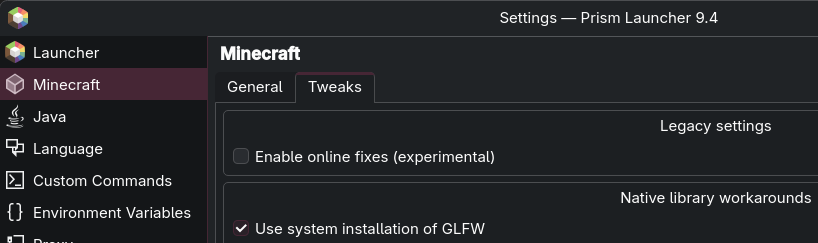
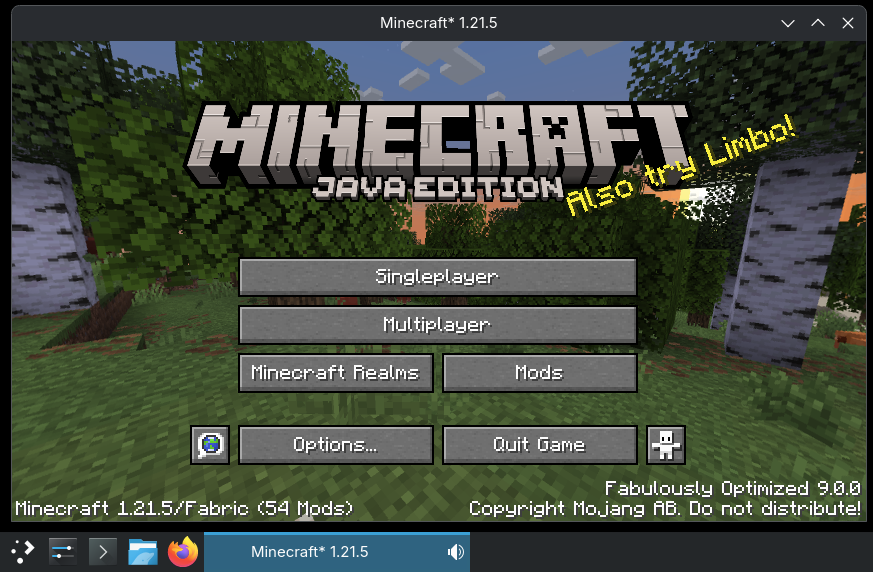
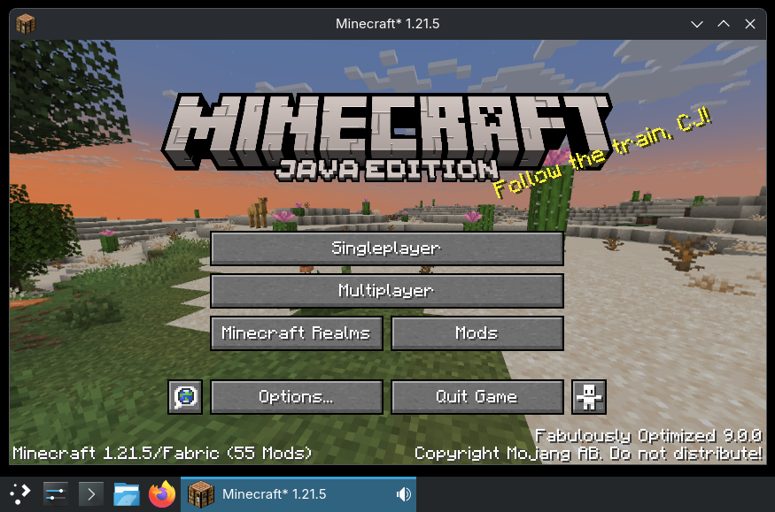

# Minecraft (1.21.x) Wayland Icon Fix (for Fabric)
This simple Fabric mod fixes the Minecraft window icon when running the game natively on Wayland.  

Minecraft by default uses XWayland, and window icons work correctly there. This mod fixes the issue with missing window icon when using a native GLFW override.

Mods that customize the Minecraft icon (commonly found in modpacks) are supported.

## Enabling native override in PrismLauncher
 

> ⚠️ Additionally, both your compositor **AND** the GLFW must support the [xdg_toplevel_icon_v1](https://wayland.app/protocols/xdg-toplevel-icon-v1) protocol. KWin supports the protocol, but upstream GLFW does not. Check out this repository which contains required patches:
https://github.com/awumii/glfw-wayland

## Screenshots
Before:
 
After:
 